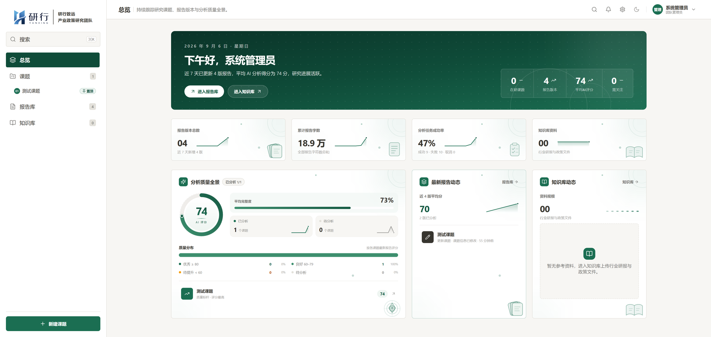
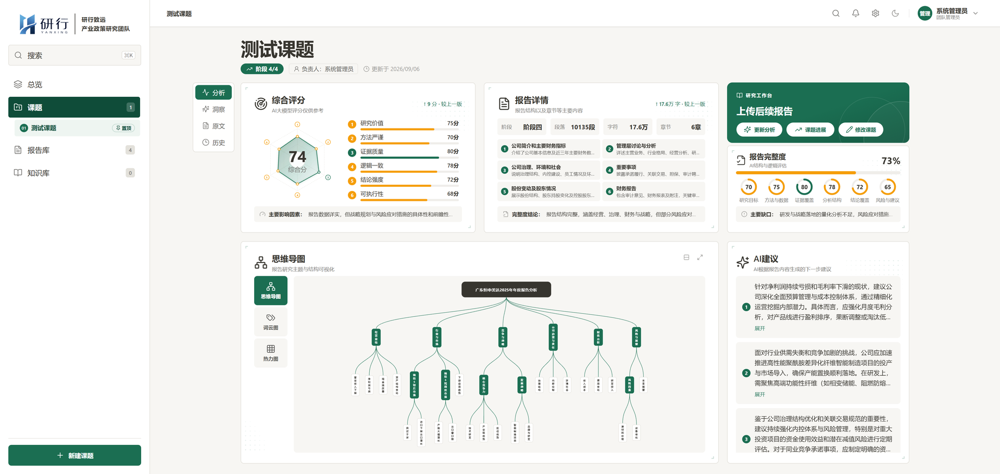
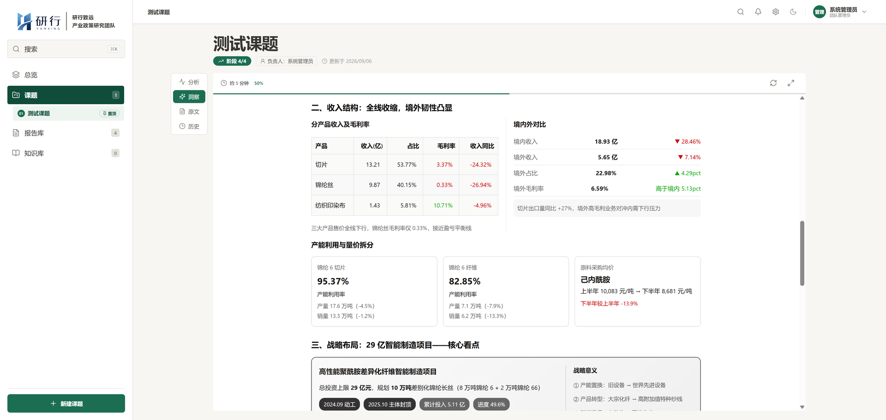
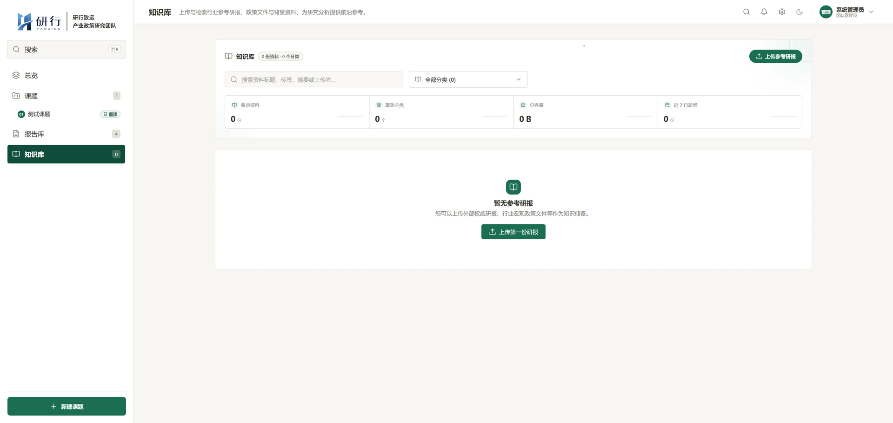
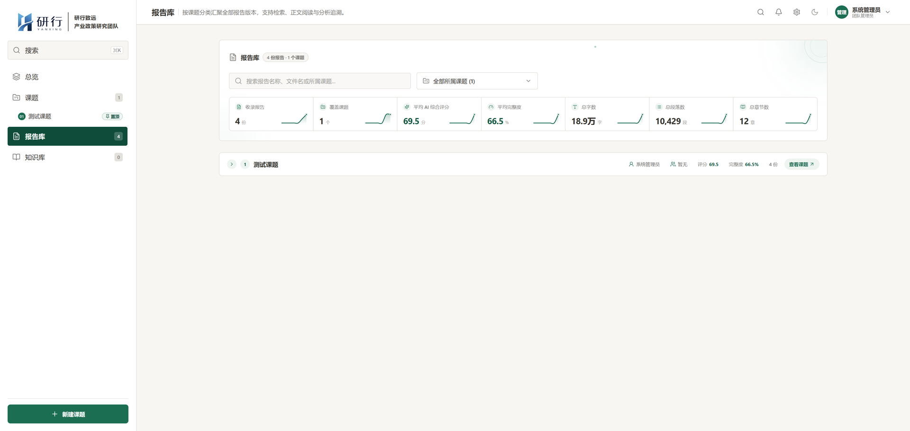
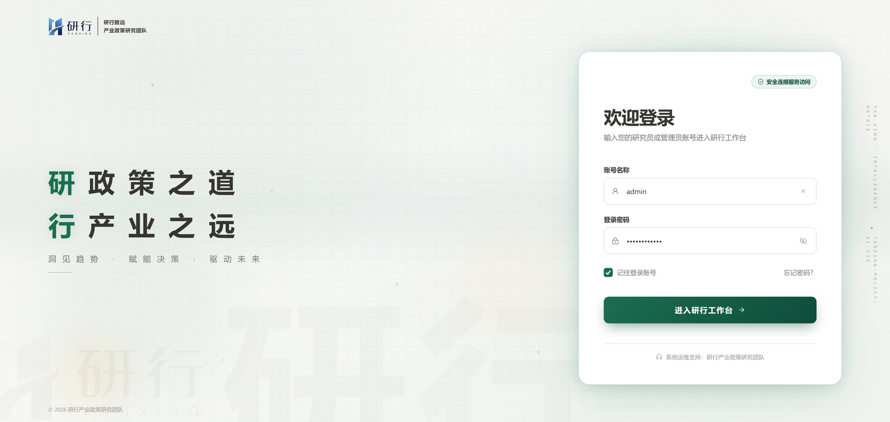
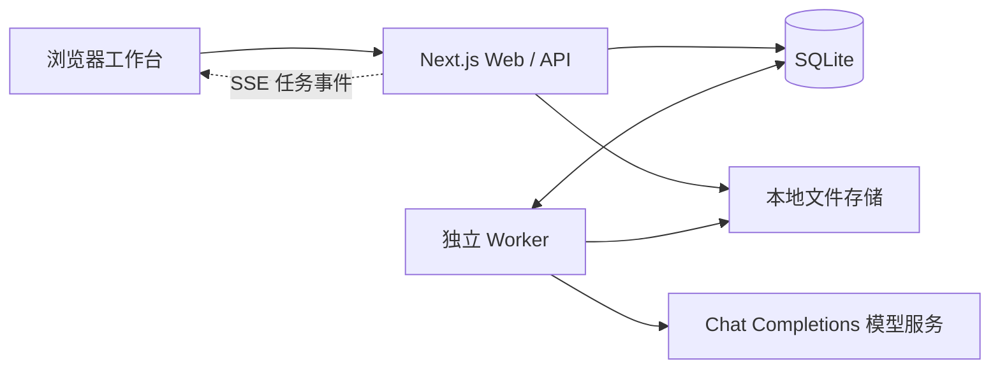

<div align="center">


# 研行 · YanXing

### 让研究有据，让洞察落地。

AI 驱动的产业政策研究工作台<br />
从一份报告，到一项课题，再到团队可持续积累的研究资产。

[](LICENSE)


**[功能亮点](#功能亮点) · [界面预览](#界面预览) · [快速开始](#快速开始) · [生产部署](#生产部署) · [参与贡献](#参与贡献)**

<br />

<a href="docs/screenshots/overview.png">
  
</a>

<sub>工作台总览 · 将课题与研究进展收拢到同一处</sub>

</div>

<br />

## 为什么选择研行

研究不止于阅读一份文档，更在于串联资料、检验结论、推进课题，并让成果能够被团队复用。

**研行（YanXing）** 面向产业研究、政策分析与课题协作场景，将 **报告解析 → AI 分析 → 课题洞察 → 知识沉淀** 整合到一个可自托管的工作台中。

- **围绕研究流程组织工作**：课题、报告、阶段交付物与洞察关联管理，减少在分散工具之间切换。
- **把长文本转化为可读结构**：结合结构化分析、词云、思维导图和热力图，辅助理解研究内容。
- **保持部署与模型选择的自主权**：Web + Worker + SQLite，无需额外部署 Redis 或独立数据库服务；模型通过 Chat Completions 兼容接口接入。

> [!NOTE]
> 自托管不等于 AI 数据完全离线。执行 AI 任务时，相关报告内容和上下文会发送至你配置的模型服务；请根据资料敏感程度选择渠道，并遵守对应的数据与隐私政策。AI 结果用于研究辅助，重要结论仍需人工核验。

## 功能亮点

| 能力 | 可以做什么 |
| :--- | :--- |
| **📄 报告解析与管理** | 上传 DOCX / PDF 研究报告，解析文本并集中管理；内建文件大小、解析资源与超时限制。 |
| **🤖 结构化 AI 分析** | 生成结构化分析结果，校验输出格式，展示任务进度；支持失败重试与结果快照。 |
| **💡 课题洞察** | 围绕课题汇总研究材料与分析结果，生成带标题、摘要与章节结构的洞察文稿，辅助梳理研究方向。 |
| **📊 研究可视化** | 使用词云、思维导图与热力图，呈现报告中的主题与结构。 |
| **🗂️ 课题与阶段管理** | 管理课题负责人、成员、里程碑预设、阶段交付物与进度。 |
| **📚 团队知识库** | 集中归档参考资料，为团队积累可持续维护的研究资料库。 |
| **👥 账号与权限** | 区分管理员与研究员角色；启用账号可查看全部课题，非课题成员只读，成员按权限编辑。 |
| **⚙️ 模型与预算管理** | 配置模型渠道，设置单用户每日 / 七日 Token 预算与多级任务队列限制。 |
| **🔔 后台任务与通知** | 独立 Worker 执行分析和洞察任务，通过 SSE 推送任务事件，并提供站内通知。 |
| **🎨 品牌与主题** | 自定义品牌标志、登录水印和品牌文案，支持明暗主题切换。 |

## 界面预览

以下为仓库随附的界面截图，点击可查看原图。页面内容与统计数值仅用于界面展示，不代表安装后自动生成的数据。

<table>
  <tr>
    <td width="50%" align="center">
      <a href="docs/screenshots/topic-detail.png"></a>
      <br /><strong>01 / 课题详情</strong><br />围绕课题组织研究与阶段推进
    </td>
    <td width="50%" align="center">
      <a href="docs/screenshots/topic-insight.png"></a>
      <br /><strong>02 / 课题洞察</strong><br />将研究材料转化为可读结论
    </td>
  </tr>
  <tr>
    <td width="50%" align="center">
      <a href="docs/screenshots/research-report.png"></a>
      <br /><strong>03 / 研究报告</strong><br />在报告层面开展研究与分析
    </td>
    <td width="50%" align="center">
      <a href="docs/screenshots/report-library.png"></a>
      <br /><strong>04 / 报告库</strong><br />集中管理研究报告与资料
    </td>
  </tr>
</table>

<details>
<summary><strong>查看登录页与品牌展示</strong></summary>

<br />

<a href="docs/screenshots/login.png"></a>

</details>

## 快速开始

### 1. 准备环境与源码

| 依赖 | 要求 |
| :--- | :--- |
| Node.js | **24.x（≥ 24.20.0）**，使用内置 `node:sqlite`；本地与 CI 的基准版本由 [.nvmrc](.nvmrc) 固定为 **24.20.0** |
| pnpm | **11.18.0**，与 [package.json](package.json) 及 Docker 构建一致 |
| 模型服务 | 执行 AI 任务时需要可用的 Chat Completions 兼容接口；仅启动和浏览页面不需要 |

获取本仓库源码后，在项目根目录执行以下命令。示例使用 Bash，适用于 Linux / macOS；Windows 建议使用 WSL2。

```bash
# 使用 nvm 时：按 .nvmrc 安装并切换到项目基准 Node.js 版本
nvm install
nvm use

# 已安装其他 Node.js 管理工具时，可自行切换到 24.20.0，再安装固定版本 pnpm
npm install --global pnpm@11.18.0
pnpm install --frozen-lockfile
cp .env.example .env
```

### 2. 配置模型渠道

全新部署可在首次创建管理员或启动前编辑 `.env`，按所选服务商填写以下初始配置；也可以先启动应用，再以管理员身份在管理端配置渠道、模型，以及分析 / 洞察的模型指派。

```dotenv
# 示例：替换为实际使用的兼容服务地址、模型名与密钥
YANXING_CHAT_COMPLETIONS_BASE_URL=https://api.openai.com/v1
YANXING_CHAT_COMPLETIONS_MODEL=gpt-4.1-mini
YANXING_CHAT_COMPLETIONS_API_KEY=your-api-key
```

这些模型环境变量仅用于首次初始化空白配置表；初始化后以数据库中的设置为准，修改 `.env` 不会覆盖已有模型配置，请通过管理端调整。完整环境配置及默认值见 [.env.example](.env.example)。不要将真实密钥写入源码、截图或提交记录。

### 3. 创建管理员并启动

使用隐藏输入，避免将密码字面量写入 shell 历史：

```bash
read -rsp "管理员密码: " YANXING_ADMIN_PASSWORD; echo
export YANXING_ADMIN_PASSWORD
pnpm user:create
unset YANXING_ADMIN_PASSWORD

pnpm dev
pnpm status
```

打开 **<http://127.0.0.1:3000>**，使用默认用户名 `admin` 和刚刚设置的密码登录。

- `user:create` 会执行数据库迁移，支持 `--username`、`--display-name` 和 `--role` 参数。
- 该命令会**创建或更新同名账号**，并使已有会话失效，不要将它作为每次启动的固定步骤。
- `pnpm dev` 由应用管理器在后台启动 Web 和 Worker，并在需要时执行迁移；使用 `pnpm stop` 停止。
- 日志默认位于 `storage/logs/`。首次使用可先建立课题、上传报告，再运行 AI 分析并查看洞察。

## 生产部署

### Docker Compose · 推荐自托管方式

宿主机只需 Docker Engine 和 Docker Compose v2（建议 2.24+），无需安装 Node.js 或 pnpm。Compose **只有一个 `app` 服务**：默认入口启动 supervisor，由它先迁移再同时管理 Web 与 Worker。以下步骤用于**全新数据部署**；已有多容器（`web` / `worker` / `migrate`）部署须先用旧 Compose 备份并 `docker compose down`（不要加 `-v`），详见部署指南。

GitHub 在 Release **发布（`published`）** 后，由 [镜像发布工作流](.github/workflows/docker-release.yml) 先以 `workflow_call` 调用 [CI](.github/workflows/ci.yml)（代码检查 / 测试 / 构建与 Docker 部署冒烟均须通过），再构建 `linux/amd64` 镜像，使用 `GITHUB_TOKEN` 推送到 `ghcr.io/anacondakc/yanxing`。镜像打上该 Release 对应的 Git 标签；仅当该 Release **未**标记为预发布时，才会同时更新 `latest`。`latest` 表示最近一次成功的稳定版发布，不是按 semver 比较得到的最高版本。该工作流没有 `workflow_dispatch`。镜像是否可用，以对应 Release 的 Actions 成功结果和 Packages 标签为准。GHCR 包默认私有，公开拉取需在 GitHub Packages 另行设置可见性。

**`v0.1.2` 是首个单容器版本**，对应镜像 `ghcr.io/anacondakc/yanxing:v0.1.2`。已发布的 `v0.1.1` / `v0.1.0` 仍是多容器旧镜像，不能与现在的单容器 `compose.yaml` 搭配。**不要假定 `latest` 已经是新布局**：`latest` 只在一次成功的非预发布稳定版发布后才会更新；在确认 `v0.1.2` 的 Actions 与 Packages 标签之前，`latest` 仍可能指向多容器的 `v0.1.1`。

GitHub Release **发布（`published`）之后**，须等待对应 Actions 的 CI、Docker 部署冒烟与镜像推送**全部成功**，并在 GitHub Packages 上确认 `v0.1.2` 标签可用，才能 `docker compose pull`。发布前或流水线尚未完成时，请用当前代码本地构建（默认 `yanxing:local`）。预构建镜像的上传上限构建参数为 `26214400`，须与运行时 `REPORT_MAX_UPLOAD_BYTES` 一致；自定义上限需自行构建。

先准备环境文件：

```bash
cp .env.example .env
chmod 600 .env

# 生成一次，并将结果保存为 .env 中的 YANXING_SETTINGS_ENCRYPTION_KEY
openssl rand -hex 32
# 编辑 .env：填入上述固定密钥，并按需配置模型渠道。不要把密钥提交进仓库。
```

**本地构建**（发布前、流水线进行中，或 Packages 尚不能确认 `v0.1.2` 时仍推荐；也适用于自定义上传上限或目标平台不是 `linux/amd64`）：

```bash
docker compose config --quiet
docker compose up -d --build --wait --wait-timeout 180
docker compose ps -a
```

`app` 共享默认上限 `YANXING_MEMORY=4g`、`YANXING_CPUS=4`、`pids_limit=512`（合并不节省内存）。Worker 默认并发 3 个任务，可配置为 1～3。单机 SQLite 不要扩容容器。旧多容器的 `YANXING_WEB_MEMORY` / `YANXING_WORKER_MEMORY` 及对应 CPU 限制应改为上述共享上限。

**从 GHCR 拉取**仅在 `v0.1.2` Release 的 Actions（CI / Docker 冒烟 / 镜像发布）全部成功、且 Packages 上 `v0.1.2` 标签已可用之后：在 `.env` 设置 `YANXING_IMAGE=ghcr.io/anacondakc/yanxing:v0.1.2`（不要使用多容器的 `v0.1.1`；不要假定 `latest` 已经是单容器布局；包仍为私有时先 `docker login ghcr.io`）。然后 `docker compose pull` 与 `docker compose up -d --no-build --wait --wait-timeout 180`。建议加上 `--no-build`，以免 Compose 在本地缺镜像时触发构建。

创建管理员（容器健康后，在正在运行的 `app` 上执行）：

```bash
read -rsp "管理员密码: " YANXING_ADMIN_PASSWORD; echo
export YANXING_ADMIN_PASSWORD
docker compose exec -e YANXING_ADMIN_PASSWORD app /app/scripts/docker-entrypoint.sh user:create
unset YANXING_ADMIN_PASSWORD
```

> [!IMPORTANT]
> 默认仅绑定宿主机 `127.0.0.1:3000`。正式登录入口必须配置 **HTTPS 反向代理**，生产认证使用 Secure Cookie。加密密钥生成后应妥善保存，不要在重启或升级时重新生成。

**[阅读完整 Docker 部署指南 →](docs/docker-deployment.md)**，包括从多容器升级、GHCR 标签与包可见性、HTTPS、旧数据迁入、备份恢复、联合健康检查、资源限制与 `docker run` 示例。

> [!WARNING]
> 普通停机使用 `docker compose stop` 或 `docker compose down`。**不要添加 `-v`**：`docker compose down -v` 会删除持久化数据卷。从旧版多容器切换过来时，也必须先用旧 Compose `down`（无 `-v`），以免孤儿 Worker 继续执行任务。

### Node.js · 直接部署

完成上面的依赖安装、环境配置和管理员创建后：

```bash
pnpm stop           # 若正在运行开发环境，先停止
pnpm build
pnpm start          # 生产模式：Web + Worker
pnpm status
```

生产环境同样需要 HTTPS 和固定的 `YANXING_SETTINGS_ENCRYPTION_KEY`。可用 `YANXING_PORT` 调整应用端口；仅在确认可信代理边界后设置 `YANXING_TRUST_PROXY`。

默认数据库、上传文件和日志位于 `storage/`；若调整了数据库或知识库存储路径，也需备份相应目录。备份应包含数据及加密密钥，并在停写或一致性快照条件下进行，详见部署指南。

## 技术架构



| 层次 | 技术选型 |
| :--- | :--- |
| 应用与界面 | Next.js 16 · React 19 · TypeScript · Tailwind CSS 4 |
| 数据与任务 | Node.js 内置 SQLite · 独立 Worker · SSE |
| 文档处理 | Mammoth · pdf-parse · docx-preview |
| 可视化 | Visx · 自定义图表组件 |
| 工程与部署 | pnpm · node:test · Docker Compose · GitHub Actions |

<details>
<summary><strong>查看项目目录</strong></summary>

```text
app/                Next.js App Router 页面与 API 路由
components/         工作台、管理端与 UI 基础组件
modules/            课题、报告、分析、洞察等领域模块
lib/                配置、数据库、模型接入、存储与安全基础设施
worker/             分析与洞察任务执行器
scripts/            进程管理、数据迁移、用户创建与测试脚本
docs/               部署文档与界面截图
test/               自动化测试
public/             品牌与静态资源
storage/            本地运行数据，不纳入版本管理
```

</details>

## 开发与维护

| 命令 | 说明 |
| :--- | :--- |
| `pnpm dev` / `pnpm start` | 开发 / 生产模式启动 Web 与 Worker |
| `pnpm stop` / `pnpm restart` / `pnpm status` | 停止、重启与查看进程状态 |
| `pnpm build` | 构建生产版本 |
| `pnpm db:migrate` | 手动执行数据库迁移与校验 |
| `pnpm user:create` | 创建或更新用户 |
| `pnpm storage:reconcile` | 存储对账与维护 |
| `pnpm typecheck` | TypeScript 类型检查 |
| `pnpm lint` | 类型检查及未使用变量 / 参数检查 |
| `pnpm test` | 运行自动化测试 |
| `pnpm check` | 依次执行 lint、test、build |

持续集成执行代码检查、测试、构建及 Docker 部署验证，具体步骤见 [CI 工作流](.github/workflows/ci.yml)。GitHub Release 发布后，[镜像发布工作流](.github/workflows/docker-release.yml) 会先调用该 CI，两者均通过后再构建并推送 GHCR 镜像。

### 常见问题

<details>
<summary><strong>支持哪些文档？可以识别扫描件吗？</strong></summary>

报告与知识库支持 PDF / DOCX。当前解析以提取文档文本为主，不包含 OCR；图片型扫描件需先在其他工具中完成文字识别。文件大小、页数、解析时间与模型上下文均有上限，具体配置见 `.env.example`。

</details>

<details>
<summary><strong>没有模型 API，可以先体验吗？</strong></summary>

可以启动应用、登录并浏览界面；真正执行 AI 分析或洞察任务时，需要配置可用的模型渠道。不同兼容服务的能力存在差异，请验证所选模型的结构化输出能力和上下文限制。

</details>

<details>
<summary><strong>为什么上传后任务一直等待？</strong></summary>

先确认 Worker 正在运行：本地部署执行 `pnpm status`，Docker 部署执行 `docker compose ps -a`（联合健康检查要求 Web 与 Worker 都通过）。再检查 `app` 日志、模型渠道、Token 预算及队列容量。Web 能打开不代表后台任务执行器已经就绪。

</details>

<details>
<summary><strong>可以部署到多台服务器吗？</strong></summary>

默认架构面向单机自托管，SQLite 与文件存储应放在本地磁盘。不要通过 NFS / SMB 在多台主机间共享数据库。Docker 也只运行一个 `app` 容器，不要横向扩容；这不是多机集群方案。

</details>

## 参与贡献

欢迎通过仓库 **Issues** 反馈问题、提出功能建议，或提交 **Pull Request** 改进代码、文档与测试。

1. Fork 仓库，为修改创建独立分支。
2. 保持改动聚焦；行为变更请补充测试，界面变更请附上截图。
3. 提交前运行 `pnpm check`；涉及 Docker 部署时，额外运行 `sh scripts/test-docker.sh`。
4. 在 PR 中说明修改动机、影响范围与验证方式。

反馈问题时，请附上运行环境、复现步骤和**已脱敏**的日志。不要提交 `.env`、真实 API 密钥、管理员密码、数据库、内部报告或含敏感信息的截图。

### 安全与隐私

项目包含模型密钥加密存储、会话与权限校验、接口限流、上传路径约束及解析资源限制。这些措施不替代部署环境的安全配置与持续维护。

**安全漏洞请勿公开提交 Issue**，请按照 [安全策略](SECURITY.md) 进行私密报告。

## 许可证

本项目基于 **[Apache License 2.0](LICENSE)** 开源。使用、修改和分发时，请遵守许可证条款并保留相应声明。

源码发行包含 Dockerfile / Compose 构建配置；GitHub Release 发布成功后，还会按工作流向 GHCR 推送 `linux/amd64` 预构建镜像（见 [生产部署](#生产部署)）。依赖与第三方组件保留各自许可证；源码分发核验、素材确认及镜像再分发注意事项见 [第三方许可证说明](docs/third-party-licenses.md)。

---

<div align="center">

**研行 · 让每一份研究，走向更有价值的洞察。**

<sub>如果研行对你的工作有所帮助，欢迎 Star，也欢迎分享你的实践与建议。</sub>

<sub>© 2026 研行产业政策研究团队</sub>

</div>
